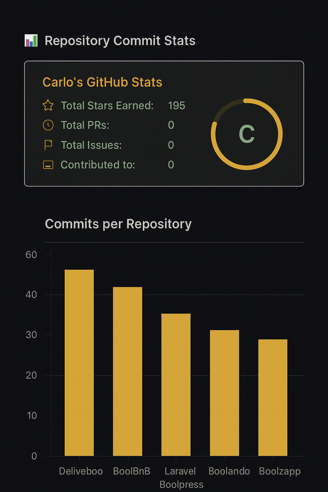

# 🧑‍💻🚀 Hi, I'm Carlo

I'm a full-stack developer trained through the Boolean bootcamp, with a strong focus on backend development and a passion for clean, accessible interfaces.

---

## 🛠 Tech Stack & Skills

---

## 🚀 Projects

Here are some of the projects I've worked on during my journey:

- 🎮 [**React Use State**](https://github.com/CarloMart88/react-use-state) — A focused exercise on managing state in React using `useState`, with dynamic UI updates
- 🛒 [**Express WebApp**](https://github.com/CarloMart88/webapp-express) — A basic Node.js + Express application showcasing routing, middleware, and server-side logic
- 🧾 [**React WebApp**](https://github.com/CarloMart88/webapp-react) — A simple React interface with component-based structure and interactive elements
- 🦸 [**React DC Comics**](https://github.com/CarloMart88/react-dc-comics) — A React-based frontend that displays DC Comics characters using dynamic routing and reusable components
- 📚 [**React Post Form**](https://github.com/CarloMart88/react-post-form) — A React form-handling demo with controlled inputs and POST request logic

> 🔍 You can explore more in my [GitHub repositories](https://github.com/CarloMart88?tab=repositories)

---

## 🎯 Currently

Preparing for a major exam — expect focused commits and deep dives into backend logic, React components, and CSS refinement.

---

## 📊 Repository Commit Stats

Here's a quick overview of my commit activity across key projects:

- **React DC Comics**: 51 commits
- **React Use State**: 45 commits
- **React Post Form**: 37 commits
- **Express WebApp**: 32 commits
- **React WebApp**: 28 commits

---

## 📫 Let's Connect

Feel free to reach out or follow my journey here on GitHub. I'm always open to learning, building, and collaborating!
